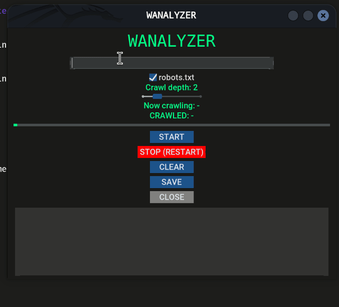

# WAnalyzer
     

Simple gui tool for basic website reconnaissance and crawling. It performs IP lookup, WHOIS checks, optional robots.txt fetching, and recursively crawls internal links up to a user-defined depth.

## Demonstration


## Installation
```bash
  # first make sure you have python installed
  git clone https://github.com/realpnut/wanalyzer
  cd wanalyzer
  chmod +x install.sh
  ./install.sh
```
    
## Disclaimer

This tool is intended for educational and research purposes only. realpnut is not responsible for any misuse, damage, or illegal activity caused by this application.


## License

[MIT](https://choosealicense.com/licenses/mit/)
